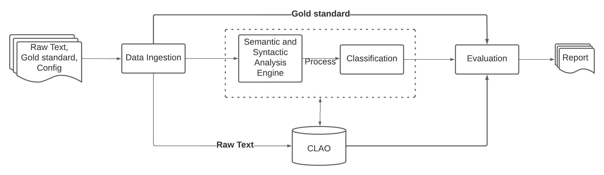
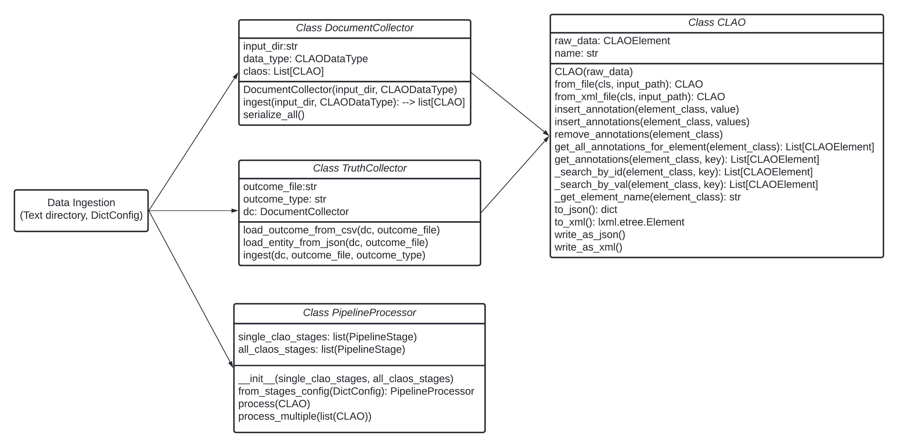
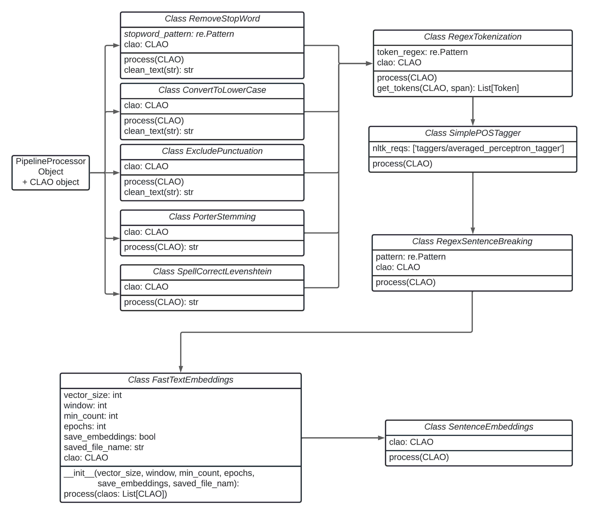
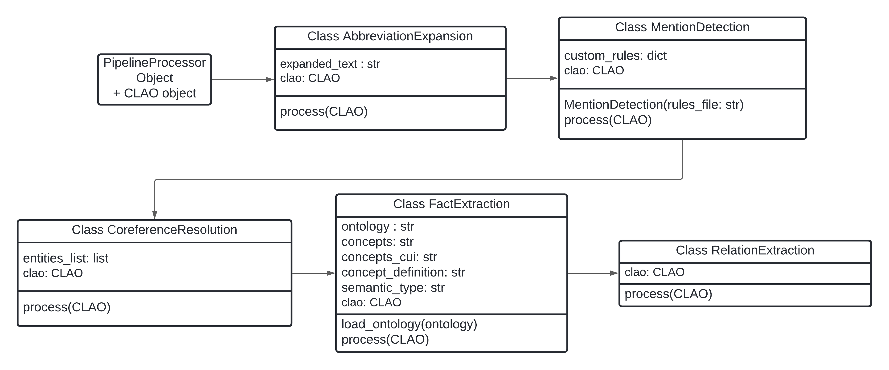
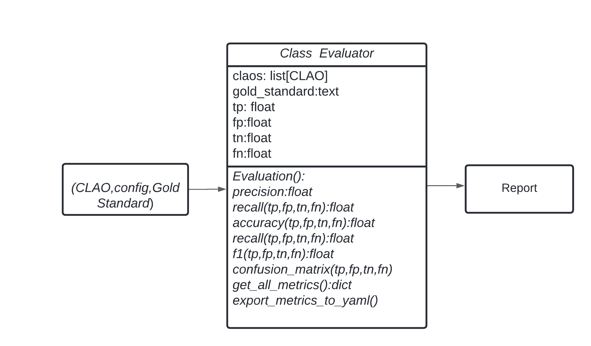

# Clinical Language Processing Toolkit (CLPT)

## Overview
The clinical language pipeline toolkit (CLPT) is a framework developed with Python which enables researchers to share their project results easily and supports research to be conducted in a fast and reproducible way. The unified annotation scheme for the CLPT is called the clinical language annotation object (CLAO). You could search/insert/and delete annotations in the CLAO. The CLPT consists of Data Ingestion module, Analysis Engine module, Classification module and Evaluation module.

The CLPT is currently in active development. The current published version mainly focuses on the CLAO annotation creation, searching, insertion and deletion as well as some pre-processing methods. A light Mention Detection function is provided and more comprehensive functions to support classification tasks will be added for future release, including (1) acronym expansion; (2) mention detection; (3) fact extraction; (4) relationship extraction.


## Docs
* [latest](https://inqbator-evicore.github.io/clpt/index.html)

### Clinical Language Processing Toolkit Workflow

## Environment Setup
**To build the environment that the code runs from:**

`./app setup-environment`

If you also need `en_core_web_sm` from spaCy. Installed it if you have not. For example,
```
wget https://github.com/explosion/spacy-models/releases/download/en_core_web_sm-3.1.0/en_core_web_sm-3.1.0.tar.gz
pip install en_core_web_sm-3.1.0.tar.gz
```


## Testing
### Test some text examples
Testing some text examples with default pipeline stages can be invoked manually by:

`python main.py`

If you want to use other configuration file, you could provide the arguments, such as below to use the `simple.yaml` instead of `default.yaml`.

`python main.py analysis=simple`

You can add your own config files to the appropriate sub-folders under `src/clpt/conf/` and run `python main.py` with the added arguments, for example, 

`python main.py ingestion={my_new_ingestion_config}`
`python main.py ingestion={my_new_ingestion_config} analysis={new_analysis_config_file_name}`

## Project Structure
The current codes are comprised of 3 semi-independent modules:
- ingestion (for Data Ingestion module)
- pipeline (for Analysis Engine module and Classification module)
- evaluation (for Evaluation module)

Each is responsible for a different processing in the pipeline. As the names imply,
`ingestion` is responsible for ingesting the document data and the gold standard outcomes (annotation or target label). `pipeline` handles creating a pipeline which comprises stages for the analysis engine module and the classification module to preprocess data as well as perform classification tasks. `evaluation` provides methods to evaluate the model performances. 


## Using the CLPT
### Provide data and gold standard outcomes file
- Provide the raw text files in a designated folder and specify the dir in `src/clpt/conf/ingestion/default.yaml`. For example, our test data is in `src/resources/sample_docs/`.
- Provide the gold standard outcomes files in the above same folder. If gold standard is annotations, structure them in json file with the name of the raw text file to be the key and the annotations to be in a list. For example, `{"1": ["difficulty", "discharge medications", "rehabilitation", "the"], "2": ["evaluation", "found down", "treatment", "syncope", "toxic", "the"]}`. If the target label is at document level, you could provide a csv file with `doc_name` to be the name of the raw text file and `actual_label` to the target label for classification/prediction.

### Update the Configuration Files
- Update the configurations file under `src/clpt/conf/`.

### Execute run
`python main.py`


----------------------------------------------------
## CLPT Workflow

### Clinical Language Pipeline Toolkit (CLPT) architecture


### Data ingestion module


### Analysis engine module
The diagram only presents the main class objects. Please refer to the `src/clpt/pipeline/stages/analysis`
for all available pre-processing stages. Each class has a method named `process` (like the method `fit_transform` in
sklearn.base.TransformerMixin) to conduct the pre-processing for each CLAO and the processed outcome will be stored 
inside the CLAO after each stage.


### Classification module


### Evaluation module



----------------------------------------------------
## Contributors
- Saranya Krishnamoorthy
- Yanyi Jiang 
- William Buchanan 
- Ayush Singh
- John E. Ortega

## Contact
Please email Saranya.Krishnamoorthy@evicore.com if you have any questions.
